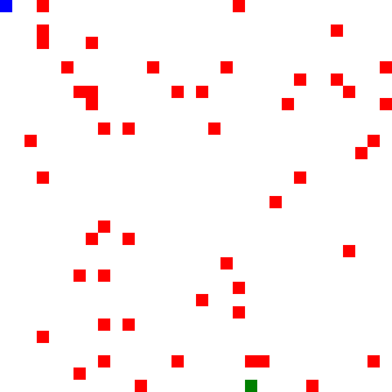
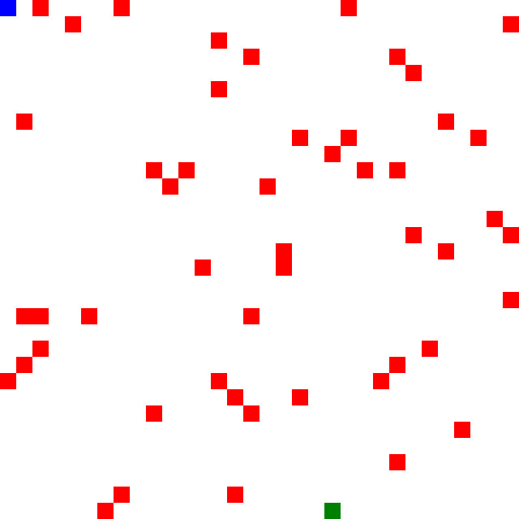
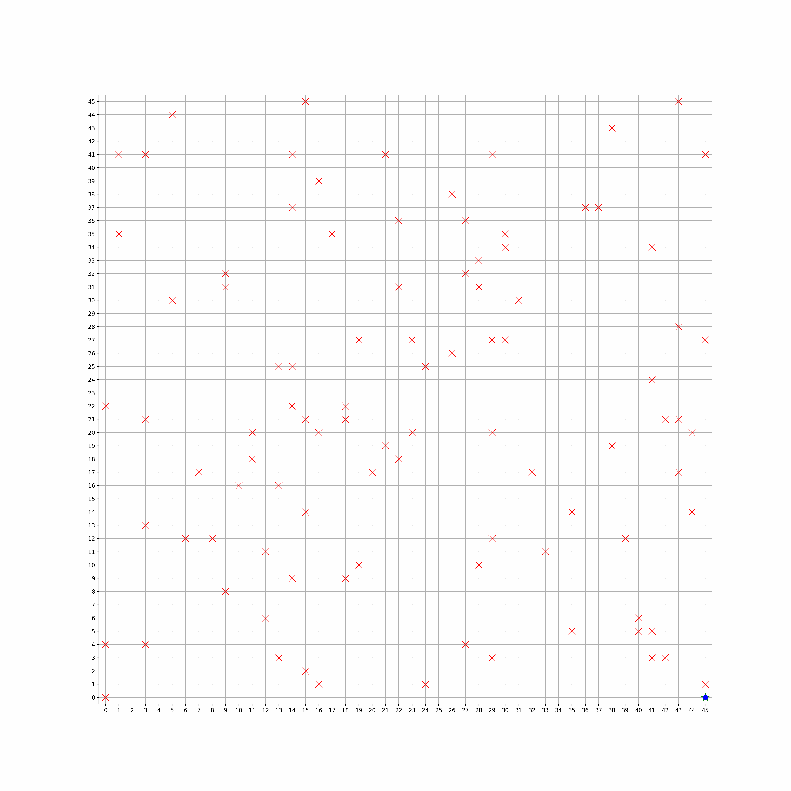

# Single and Multi-Agent Reinforcement Learning (Q-Learning) with CUDA, C++ and Python

Girish Krishnan | [LinkedIn](https://www.linkedin.com/in/girk/) | [GitHub](https://github.com/Girish-Krishnan)
___

|||
|---|---|

This project demonstrates **Single and Multi-Agent Reinforcement Learning** using **Q-Learning** on a grid-world environment. Agents start at position $(0,0)$ and must reach a goal position $(\text{flag}_x , \text{flag}_y)$ while avoiding any cells marked as mines. The project provides implementations in:

* **Python** (NumPy)
* **C++** (single-threaded)
* **C++ with CUDA** (GPU-accelerated)

---

## Overview of Q-Learning

**Q-Learning** is a model-free reinforcement learning algorithm where we learn an action-value function $Q(s,a)$ that gives the expected utility of taking action $a$ in state $s$. The Q-value is updated iteratively using the following rule:

$$Q(s,a) \leftarrow Q(s,a) + \alpha \left[ r + \gamma \max_{a'} Q(s',a') - Q(s,a) \right]$$

where:

* $s$ is the current state
* $a$ is the action taken
* $r$ is the reward received
* $s'$ is the next state
* $\alpha$ is the learning rate
* $\gamma$ is the discount factor
* $Q(s,a)$ is the Q-value for the current state-action pair
* $\max_{a'} Q(s',a')$ is the maximum Q-value for the next state

---

## Installation Requirements

1. **Python** (for `single_agent.py` and `multi_agent.py`)
  * Python 3.x
  * `numpy`
  * `matplotlib`
  * `tqdm`
  * `argparse`
2. **C++** (for `single_agent.cpp` and `multi_agent.cpp`)
  * C++11 or later compiler
  * [ImageMagick](https://imagemagick.org/) (Magick++) if you want to generate GIFs of the policy in action
3. **CUDA** (for `single_agent.cu` and `multi_agent.cu`)
  * NVIDIA GPU with CUDA toolkit installed
  * A C++ compiler that supports CUDA (e.g. `nvcc`)
  * [ImageMagick](https://imagemagick.org/) (Magick++) if you want to generate GIFs of the policy in action

---

## Usage and Arguments

Below are the command-line arguments for each script. Defaults match the original code.

### Single-Agent Python (`single_agent.py`)

|Argument|Type|Default|Description|
|---|---|---|---|
|`--size`|int|32|Grid size (square)|
|`--n_mines`|int|40|Number of mines in the environment.|
|`--flag_x`|int|31|X-coordinate of the goal position.|
|`--flag_y`|int|31|Y-coordinate of the goal position.|
|`--episodes`|int|20000|Number of episodes to train the agent.|
|`--alpha`|float|0.1|Learning rate.|
|`--gamma`|float|0.9|Discount factor.|
|`--epsilon`|float|0.1|Exploration rate.|
|`--gif_path`|str|`""`|Path to save the GIF of the policy in action. If not provided, the GIF is not saved.|
|`--max_steps`|int|100|Maximum number of steps for visualization (GIF).|

**Run Example**:

```bash
python single_agent.py --size 32 --n_mines 40 --episodes 20000 --gif_path single_agent_policy.gif
```

### Single-Agent C++ (`single_agent.cpp`)

|Argument|Type|Default|Description|
|---|---|---|---|
|`--size`|int|32|Grid size (square)|
|`--n_mines`|int|40|Number of mines in the environment.|
|`--flag_x`|int|31|X-coordinate of the goal position.|
|`--flag_y`|int|31|Y-coordinate of the goal position.|
|`--episodes`|int|20000|Number of episodes to train the agent.|
|`--alpha`|float|0.1|Learning rate.|
|`--gamma`|float|0.9|Discount factor.|
|`--epsilon`|float|0.1|Exploration rate.|
|`--max_steps`|int|200|Maximum number of steps for visualization (GIF).|
|`--cell_size`|int|20|Size of each cell (in pixels) in the visualization.|
|`--gif_path`|str|`""`|Path to save the GIF of the policy in action. If not provided, the GIF is not saved.|

**Compilation (example)**:

*Note*: You may need to use the `-I` flag to specify the path to the ImageMagick headers.

```bash
g++ -std=c++11 single_agent.cpp -o single_agent -lMagick++ -lMagickCore -lMagickWand
```

**Run Example**:

```bash
./single_agent --size 32 --episodes 20000 --gif_path single_agent_policy.gif
```

### Single-Agent CUDA (`single_agent.cu`)

|Argument|Type|Default|Description|
|---|---|---|---|
|`--size`|int|32|Grid size (square)|
|`--n_mines`|int|40|Number of mines in the environment.|
|`--flag_x`|int|31|X-coordinate of the goal position.|
|`--flag_y`|int|31|Y-coordinate of the goal position.|
|`--episodes`|int|20000|Number of episodes to train the agent.|
|`--alpha`|float|0.1|Learning rate.|
|`--gamma`|float|0.9|Discount factor.|
|`--epsilon`|float|0.1|Exploration rate.|
|`--max_steps`|int|1000|Max steps per episode.|
|`--blocks`|int|128|Number of blocks in the CUDA grid.|
|`--threads_per_block`|int|128|Number of threads per block in CUDA.|
|`--gif_path`|str|`""`|Path to save the GIF of the policy in action. If not provided, the GIF is not saved.|
|`--cell_size`|int|20|Size of each cell (in pixels) in the visualization.|
|`--gif_max_steps`|int|200|Maximum number of steps for visualization (GIF).|

**Compilation (example)**:

```bash
nvcc single_agent.cu -o single_agent_cuda -lMagick++ -lMagickCore -lMagickWand
```

**Run Example**:

```bash
./single_agent_cuda --episodes 20000 --blocks 128 --threads_per_block 128 --gif_path single_agent_policy.gif
```

### Multi-Agent Python (`multi_agent.py`)

|Argument|Type|Default|Description|
|---|---|---|---|
|`--size`|int|46|Grid size (square)|
|`--n_mines`|int|96|Number of mines in the environment.|
|`--flag_x`|int|45|X-coordinate of the goal position.|
|`--flag_y`|int|45|Y-coordinate of the goal position.|
|`--n_agents`|int|512|Number of agents in the environment.|
|`--episodes`|int|1000|Number of episodes to train the agents.|
|`--alpha`|float|0.1|Learning rate.|
|`--gamma`|float|0.9|Discount factor.|
|`--epsilon`|float|0.1|Exploration rate.|
|`--gif_path`|str|`""`|Path to save the GIF of the policy in action. If not provided, the GIF is not saved.|
|`--max_steps`|int|100|Maximum number of steps for visualization (GIF).|

**Run Example**:

```bash
python multi_agent.py --size 46 --n_agents 512 --episodes 1000 --gif_path multiagent_policy.gif
```

### Multi-Agent C++ (`multi_agent.cpp`)

|Argument|Type|Default|Description|
|---|---|---|---|
|`--size`|int|46|Grid size (square)|
|`--n_mines`|int|96|Number of mines in the environment.|
|`--flag_x`|int|45|X-coordinate of the goal position.|
|`--flag_y`|int|45|Y-coordinate of the goal position.|
|`--n_agents`|int|512|Number of agents in the environment.|
|`--episodes`|int|1000|Number of episodes to train the agents.|
|`--alpha`|float|0.1|Learning rate.|
|`--gamma`|float|0.9|Discount factor.|
|`--epsilon`|float|0.1|Exploration rate.|
|`--max_steps`|int|200|Maximum number of steps for visualization (GIF).|
|`--cell_size`|int|20|Size of each cell (in pixels) in the visualization.|
|`--gif_path`|str|`""`|Path to save the GIF of the policy in action. If not provided, the GIF is not saved.|

**Compilation (example)**:

```bash
g++ -std=c++11 multi_agent.cpp -o multi_agent -lMagick++ -lMagickCore -lMagickWand
```

**Run Example**:

```bash
./multi_agent --size 46 --n_agents 512 --episodes 1000 --gif_path multiagent_policy.gif
```

### Multi-Agent CUDA (`multi_agent.cu`)

|Argument|Type|Default|Description|
|---|---|---|---|
|`--size`|int|46|Grid size (square)|
|`--n_mines`|int|96|Number of mines in the environment.|
|`--flag_x`|int|45|X-coordinate of the goal position.|
|`--flag_y`|int|45|Y-coordinate of the goal position.|
|`--n_agents`|int|512|Number of agents in the environment.|
|`--episodes`|int|1000|Number of episodes to train the agents.|
|`--alpha`|float|0.1|Learning rate.|
|`--gamma`|float|0.9|Discount factor.|
|`--epsilon`|float|0.1|Exploration rate.|
|`--max_steps_per_episode`|int|1000|Max steps per episode.|
|`--threads_per_block`|int|256|Number of threads per block in CUDA.|
|`--gif_path`|str|`""`|Path to save the GIF of the policy in action. If not provided, the GIF is not saved.|
|`--cell_size`|int|20|Size of each cell (in pixels) in the visualization.|
|`--gif_max_steps`|int|200|Maximum number of steps for visualization (GIF).|

*Note*: we don't have a `blocks` argument here because the number of blocks is calculated as `blocks = (n_agents + threads_per_block - 1) / threads_per_block;`.

**Compilation (example)**:

```bash
nvcc multi_agent.cu -o multi_agent_cuda -lMagick++ -lMagickCore -lMagickWand
```

**Run Example**:

```bash
./multi_agent_cuda --n_agents 512 --episodes 1000 --threads_per_block 256 --gif_path multiagent_policy.gif
```

---

Here is an example output visualization obtained from running one of the Python programs:



Here is an example output visualization obtained from running one of the C++ programs. The visualization is slightly different because the C++ version uses ImageMagick instead of Matplotlib for generating the GIF.


---

## Algorithm Details

### Single-Agent Q-Learning

1. Initialize a Q-table of size $\text{gridSize} \times \text{gridSize} \times 4$, where the 4 represents the 4 possible actions (up, down, left, right).
2. Start the agent at position $(0,0)$.
3. At each step, choose an action $a$ using an $\epsilon$-greedy policy, where $\epsilon$ is the exploration rate.
4. Execute the action, observe the next state $s'$ and the reward $r$.
5. Update the Q-value using the Q-learning update rule.
$$Q(s,a) \leftarrow Q(s,a) + \alpha \left[ r + \gamma \max_{a'} Q(s',a') - Q(s,a) \right]$$
6. Repeat until the agent reaches the flag or hits a mine (episode ends).
7. Repeat steps 2-6 for a fixed number of episodes.

### Multi-Agent Q-Learning

1. Multiple agents each maintain a position in the grid.
2. Each agent picks an action and updates the global Q-table with the same rule as single-agent Q-learning.
3. Once an agent dies (hits a mine) or finishes (reaches flag), it becomes inactive.
4. If fewer than 20% of the agents are active, reset the environment and start a new episode.

### CUDA Parallelization

1. In single-agent CUDA, each thread in a CUDA block runs an entire episode independently.
2. In multi-agent CUDA, all agents share a global Q-table. A kernel reset initializes agent states in parallel, and then each agent chooses actions concurrently, updating Q using atomic operations.
3. This allows many episodes (or many agents) to run in parallel on the GPU, significantly speeding up training.

---

## License

This project is licensed under the MIT License - see the [LICENSE](LICENSE) file for details.